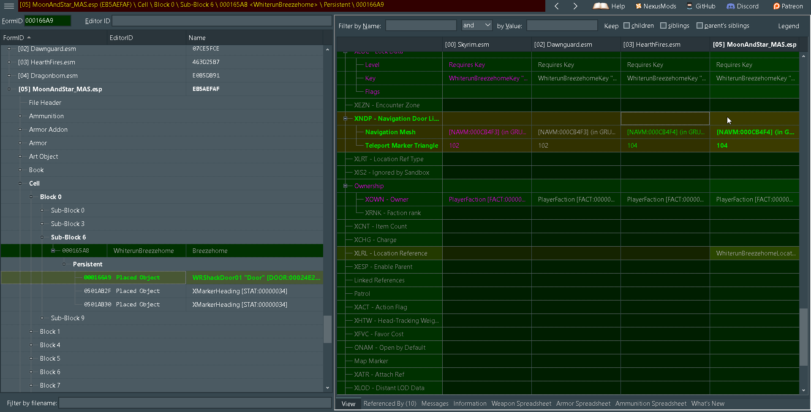
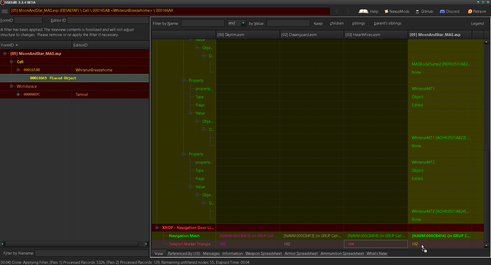

## Manual Cleaning Guides

### Wild Edits

1. [Teleport - City Spells](#-teleport---city-spells-)
2. [Teleport - Faction Spells](#-teleport---faction-spells-)
3. [Teleport - Towns and Villages](#-teleport---towns-and-villages-)
4. [Moon & Star](#-moon-and-star-)
5. [Distinct Interiors](#-distinct-interiors-)

---

### [ Teleport - City Spells ](https://www.nexusmods.com/skyrimspecialedition/mods/7015/)

`TheWulfPanda - City Teleport Spells.esp`  
or  
`TheWulfPanda - City Teleport Spells Less Magicka Increase Cast Time.esp`

#### Edit the following record(s) with SSEEdit
1. Remove record `0000939D`
2. Remove record `00037EE9`
3. Remove record `0001A27F`
4. Remove record `00020EE7`
5. Remove record `00042249`

The Wild edits are now corrected, you can save the changes to the cleaned plugin with `ctrl+s` or when prompted before exiting SSEEdit.

---

### [ Teleport - Faction Spells ](https://www.nexusmods.com/skyrimspecialedition/mods/6991/)

`TheWulfPanda - Faction Teleport Spells.esp`  
or  
`TheWulfPanda - Faction Teleport Spells Less Magicka Increased Cast Time.esp`

#### Edit the following record(s) with SSEEdit

1. Remove the Worldspace record.
2. Remove the record `02010521`.
3. Remove the record `02007320`.
4. Remove the record `000CA72C`.
5. Remove the record `000B3434`.
6. Remove the record `000C0291`.
7. Open cell record `000AD5A1`.
- Right click the empty field of the `XCCM` subrecord and from the context menu select `Add`.
  
- You should now see a `Null` formid value in the field of the `XCCM` subrecord.  
  
- Right click the NULL value and select edit from the context menu.
  
- Replace the `Null` value with `0002A72D` and select ok.
  
- You should now see the value `WeatherPineForest` in the field of the `XCCM` subrecord of Faction Teleport Spells.
  
- The Wild edits are now corrected, you can save the changes to the cleaned plugin with `ctrl+s` or when prompted before exiting SSEEdit.

---

### [ Teleport - Towns and Villages ](https://www.nexusmods.com/skyrimspecialedition/mods/7267/)

`TheWulfPanda - Teleport Spells Towns and Villages.esp`  
or  
`TheWulfPanda - Teleport Spells Towns and Villages Less Magicka Increase Cast Time.esp`

#### Edit the following record(s) with SSEEdit
- Remove cell record DragonBridgeExterior03 `00009349`

- Remove cell record Riverwood `00009732`

- Remove cell record IvarsteadExterior02 `000097BF`.

- Remove the value in subrecord `XCWT` of cell record `00009731`.

The Wild edits are now corrected, you can save the changes to the cleaned plugin with `ctrl+s` or when prompted before exiting SSEEdit.

---

### [ Moon and Star ](https://www.nexusmods.com/skyrimspecialedition/mods/4301/)

`MoonAndStar_MAS.esp`

#### Edit the following record(s) with SSEEdit
- Open SSEEDIT.
- Right click and select none.
- Select `Heartfires.esm` and `MoonAndStar_MAS.esp`.
- Add `Heartfires.esm` as a master to `MoonAndStar_MAS.esp`.

  
  

- Open record `000166A9`

  

- Drag & Drop these values from `Heartfires.esm` to `MoonAndStar_MAS.esp`.
    
    - `Navigation Mesh`

  

  
    
    - `Teleport Marker Triangle`

  

  

The Wild edits are now corrected, you can save the changes to the cleaned plugin with `ctrl+s` or when prompted before exiting SSEEdit.

---

### [ Distinct Interiors ](https://www.nexusmods.com/skyrimspecialedition/mods/6130/)

`Distinct Interiors.esp`  
or  
`Distinct Interiors - Player Homes.esp`

#### Edit the following record(s) with SSEEdit
- Remove the deleted record `000CB4F3` from `Distinct Interiors.esp`
  

The Wild edits are now corrected, you can save the changes to the cleaned plugin with `ctrl+s` or when prompted before exiting SSEEdit.
